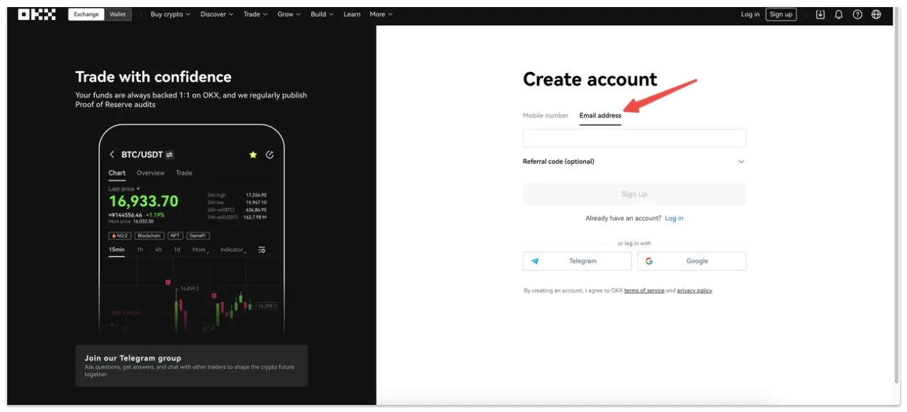
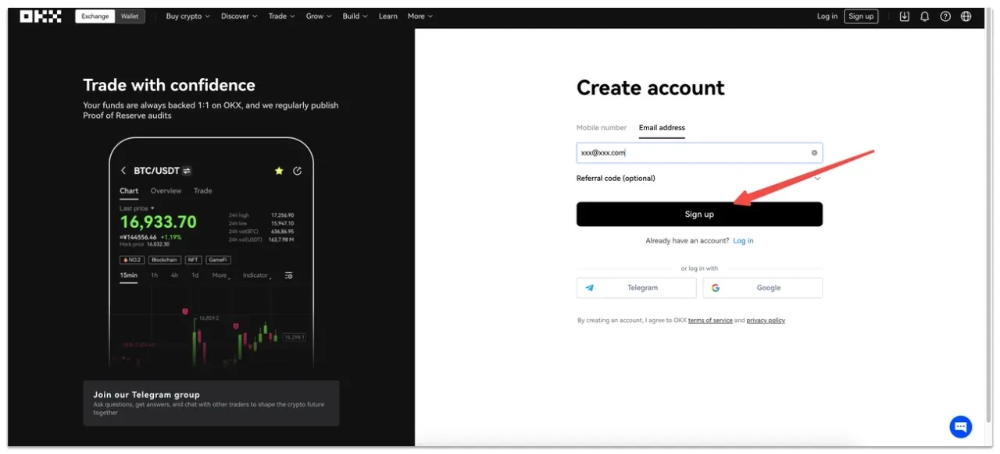
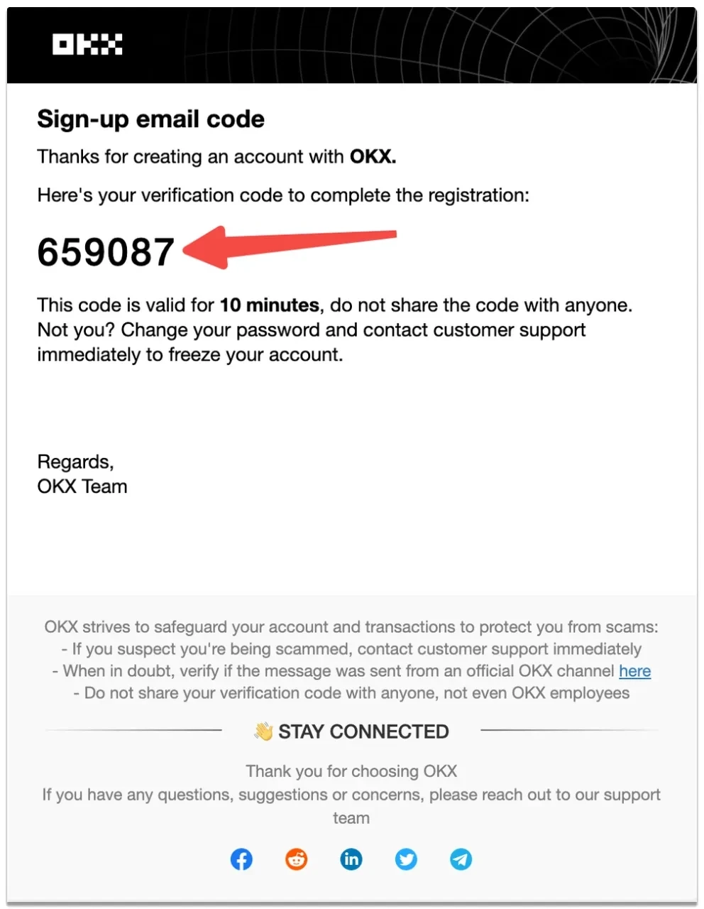
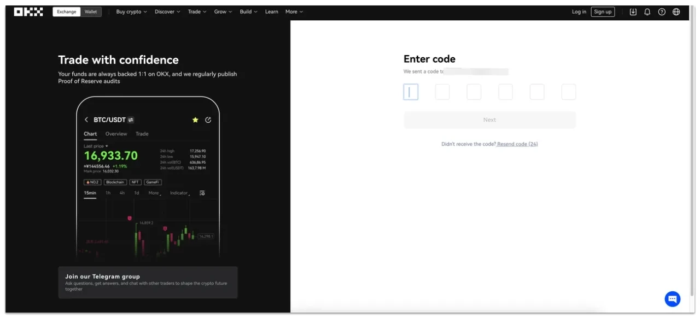
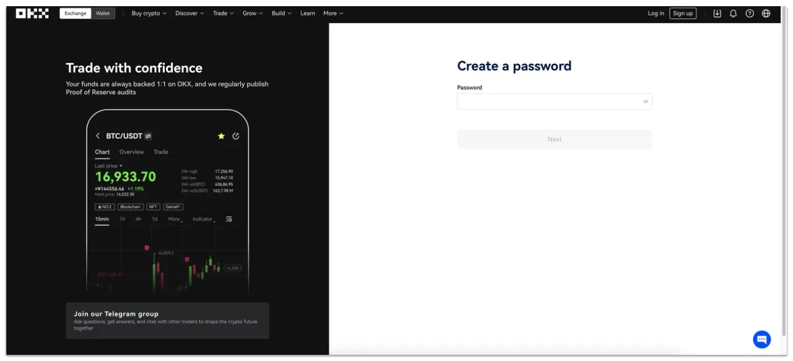
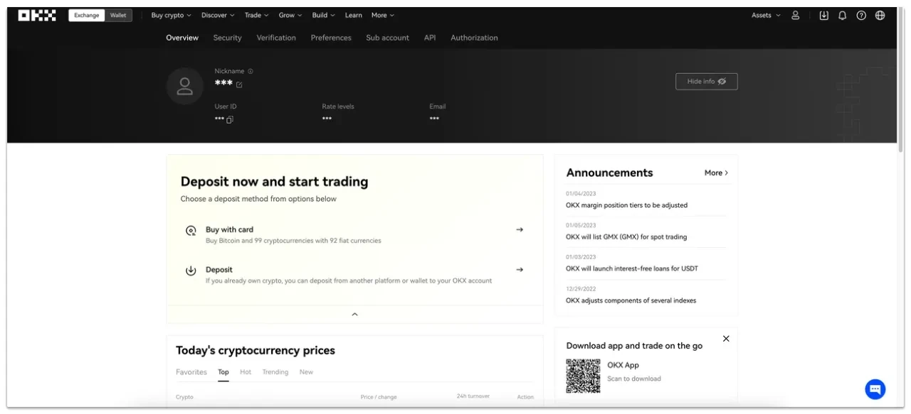
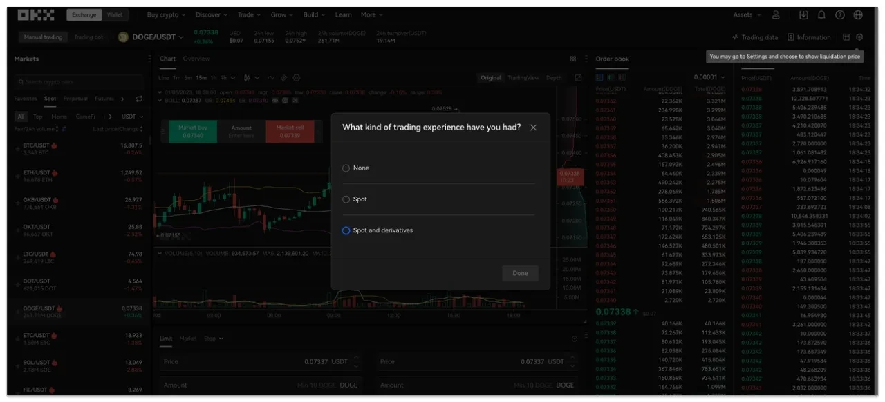
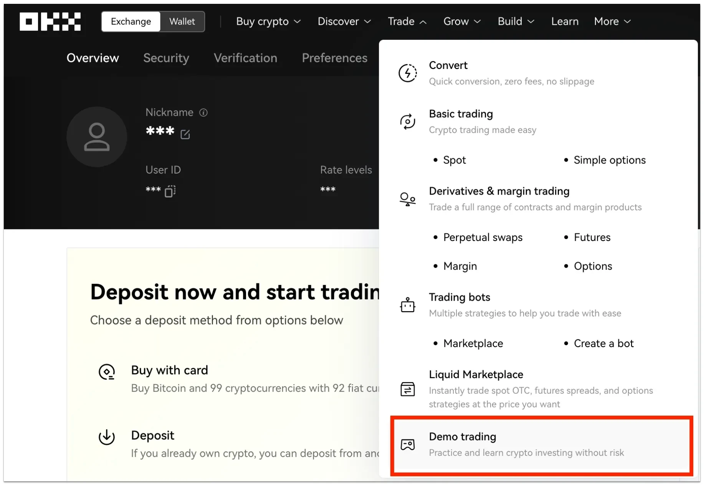

# How to Register an OKX Account – Complete Step-by-Step Guide

Registering for an OKX account takes just a few minutes and gives you access to one of the world's most powerful cryptocurrency trading platforms. Whether you're a complete beginner or an experienced trader, this straightforward process will have you set up and ready to explore everything OKX has to offer—from spot trading and futures to DeFi and Web3 features. Follow this simple guide to get started today.

---

## Step 1: Access the Registration Page

Click the registration link below to get started with exclusive trading fee discounts. Once you land on the **OKX.com** homepage, look for the "**Register**" button prominently displayed at the top of the page.

This takes you directly to the signup form where you'll begin creating your account.

## Step 2: Enter Your Email Address

Type your email address into the designated Email field. Make sure it's an email you regularly check—OKX will use this to send you verification codes and important account updates.

Don't worry about making it fancy. Just use whichever email feels most convenient.

## Step 3: Click the Register Button

Once you've entered your email, hit the "Register" button. This kicks off the verification process. 

The platform will immediately send a verification code to your inbox—so keep that email tab handy.

## Step 4: Check Your Email for Verification Code

Head over to your email inbox and look for a message from OKX. Inside, you'll find a six-digit verification code that was automatically generated for you.

This code is time-sensitive, so grab it quickly and move to the next step.

## Step 5: Enter the Verification Code

You've got 10 minutes to enter that six-digit code into the "Enter code" field back on the OKX page. Once you've typed it in, click "Next" to proceed.

If the code expires, no big deal—just request a new one.

## Step 6: Create a Strong Password

Now comes the important part: securing your account. Enter a password in the Password field that you'll use to protect your account going forward. When you're satisfied with your choice, click "Next."

Here's what makes a solid password:

- Mix numbers, letters, symbols, and both uppercase and lowercase characters
- Follow cryptocurrency security best practices—treat this like your bank account
- Never share your password with anyone, even if they claim to work for OKX

Think of your password as the lock on your crypto vault. Make it strong.

## Step 7: Choose Your Next Move

Congratulations! You now have access to your OKX account dashboard. From here, you have two main options to get started:

- **Buy with Card**: Purchase Bitcoin and over 99 other cryptocurrencies using 92 different fiat currencies. Perfect if you're starting from scratch.
- **Deposit**: If you already own crypto, you can transfer funds from another platform or wallet directly into your OKX account.

Pick whichever route matches where you're at in your crypto journey. 👉 [Ready to start trading with lower fees and powerful tools?](https://www.okx.com/join/47044926)

## Step 8: Explore Trading Options

Hover over the "Trade" menu in the navigation bar and select whichever option catches your interest. Before you dive into actual trading, OKX will ask you a few questions about your trading experience—just to make sure you're comfortable with what you're getting into.

This quick survey helps OKX tailor the experience to your skill level.

## Step 9: Try Demo Trading (Optional but Recommended)

Whether you're brand new to trading or a seasoned pro wanting to test advanced strategies, OKX's demo mode lets you trade with virtual assets. No real money at risk—just pure practice.

To access it, hover over the Trade menu again and select "Demo Trading." This opens up a full trading environment where you can experiment freely.

It's like a flight simulator for crypto trading. Play around, make mistakes, learn the ropes—all without any financial consequences.

---

## Final Thoughts

And there you have it—nine straightforward steps to get your OKX account up and running. The whole process is designed to be quick and painless, whether you're buying your first fraction of Bitcoin or setting up a sophisticated trading operation. OKX offers one of the most comprehensive platforms in the crypto space, combining ease of use with professional-grade tools. The registration is just the beginning—from here, you can explore spot markets, try futures trading, stake your assets, or dive into the growing world of Web3. 👉 [Join thousands of traders who trust OKX for their cryptocurrency needs](https://www.okx.com/join/47044926) and discover why it's become a go-to platform for both beginners and experts alike.
